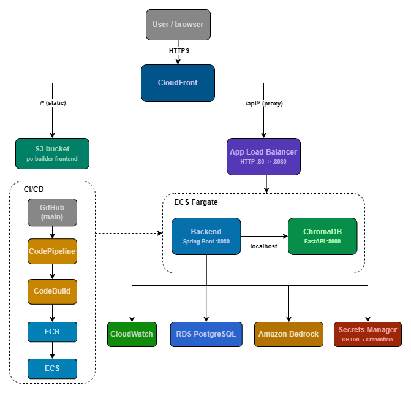

# AI PC Builder

A web application for building PC configurations with AI assistance. Users can either go through a guided build process where an LLM picks components based on their requirements, or chat freely with the model about PC parts.

## Architecture

**Frontend:** Angular, hosted on S3, served via CloudFront

**Backend:** Spring Boot (Java), running on ECS Fargate

**Vector store:** ChromaDB (Python/FastAPI), running on ECS Fargate in the same task as the backend

**Database:** PostgreSQL on AWS RDS

**LLM:** Amazon Bedrock (replaced local Ollama for deployment)


<br>
<em>Request flow and service relationships for the production deployment.</em>

## How it works

There are two roles: admin and user. Admins can only be added directly through the database.

**Admin:**
- Full CRUD on PC components
- Can write prompts/knowledge entries that get stored in both PostgreSQL and ChromaDB (e.g. recommendations, notes about specific parts). These are loaded into ChromaDB on startup.

**User:**
- Guided build mode: specify requirements and a price limit, the LLM picks components from the available inventory
- Chat mode: ask questions about the parts in the database

ChromaDB maintains three collections: `pc_components`, `admin_knowledge`, and `user_messages` (capped at 50 messages per user). On startup, admin prompts and relevant messages are synced from PostgreSQL into ChromaDB if they don't already exist.

## AWS Services

| Service | Purpose |
|---|---|
| ECS Fargate | Runs backend and ChromaDB containers |
| RDS (PostgreSQL) | Primary database |
| S3 | Hosts Angular build output |
| CloudFront | CDN for frontend + reverse proxy for API (`/api/*` routes to ALB) |
| Amazon Bedrock | LLM inference (replaces Ollama) |
| Secrets Manager | Stores `DB_URL`, `DB_USERNAME`, `DB_PASSWORD` |
| ECR | Stores Docker images for backend and chroma |
| CodePipeline + CodeBuild | CI/CD: builds and pushes images to ECR, deploys to ECS on push to main |
| CloudWatch | Log groups for ECS containers, metric filter on ERROR logs, alarm + SNS email alert |

## CI/CD

A single CodePipeline (`pc-builder-pipeline`) triggers on push to `main`. CodeBuild builds both Docker images using a combined `buildspec.yml`, pushes them to ECR, and deploys atomically to the ECS service. This avoids the race condition that occurs when two separate pipelines deploy to the same service simultaneously.

## IAM Setup

- `ecsTaskRole-pc-builder` — attached to ECS tasks, has `AmazonBedrockFullAccess`
- `ecsTaskExecutionRole-pc-builder` — used by ECS to pull images and read secrets, has `AmazonECSTaskExecutionRolePolicy` + `AWSSecretsManagerClientReadOnlyAccess`
- `codebuild-pc-builder-role` — used by CodeBuild, has ECR push access, S3, Secrets Manager read, and CloudWatch Logs

## Local Development

Run:

```bash
docker compose up --build
```

The compose file runs backend and chroma. The database and other connection details are configured via environment variables in compose.yaml and can be swapped freely between local and production values.

## Environment Variables (Backend)

| Variable | Source (prod) | Description |
|---|---|---|
| `DB_URL` | Secrets Manager | JDBC connection string |
| `DB_USERNAME` | Secrets Manager | Database user |
| `DB_PASSWORD` | Secrets Manager | Database password |
| `CHROMA_URL` | Task definition (plain value) | `http://localhost:8000` in prod |